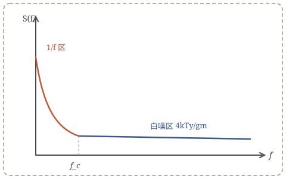

> **原文**：*Low-Noise Opamp Design and Noise Matching Strategy*, 示例作者 et al., IEEE JSSC, 2024。
> **TL;DR**：输入对管面积增大在 1/f 噪声主导区收益显著，而在热噪声主导区收益趋于饱和；最优尺寸出现在闪烁噪声转角频率 $f_c$ 接近信号带宽下限的位置。

## 背景与动机

在传感器前端与音频链路中，运放的等效输入噪声直接决定系统的动态范围。设计者通常面临两类噪声源的权衡：与 $g_m$ 成反比的沟道热噪声，以及与栅面积成反比的闪烁噪声。本文的目标是给出一个可复用的尺寸匹配流程，在给定功耗预算下最小化总输入噪声。

## 关键方法

MOS 管沟道热噪声可建模为

$$\overline{v_{n,th}^2} = \frac{4kT\gamma}{g_m}$$

闪烁噪声建模为

$$\overline{v_{n,1/f}^2} = \frac{K_f}{C_{ox}WL} \cdot \frac{1}{f}$$

两者谱密度相等处定义转角频率

$$f_c = \frac{K_f g_m}{4kT\gamma C_{ox}WL}$$

作者指出：当 $f_c$ 高于信号带宽下限时，总积分噪声由闪烁噪声主导，增大 $WL$ 收益明显；反之热噪声主导，继续增大面积仅推高寄生极点而无噪声收益。

## 噪声谱示意

## 实验结果与性能指标

| 指标 | 本文结果 | 参考值 |
| --- | --- | --- |
| 输入噪声密度 @1kHz | 3.2 nV/√Hz | 4.5 nV/√Hz |
| 闪烁噪声转角频率 | 12 Hz | 30 Hz |
| 静态电流 | 850 uA | 1.2 mA |
| 单位增益带宽 | 18 MHz | 15 MHz |

## 个人思考与总结

- 输入对管取 PMOS 优于 NMOS 的结论在深纳米工艺下依然成立，但 $K_f$ 的工艺相关性需要实测标定。
- 斩波稳定技术可以把转角频率压到亚 Hz 量级，代价是引入纹波与 Charge Injection，适合带宽极低的场景。
- 论文的"面积-噪声"曲线对版图失配计算同样有参考意义。

> **可关联工具**：使用 [噪声快速计算](../../tools/noise-calc/index.html) 验证论文中的热噪声与闪烁噪声数据。
